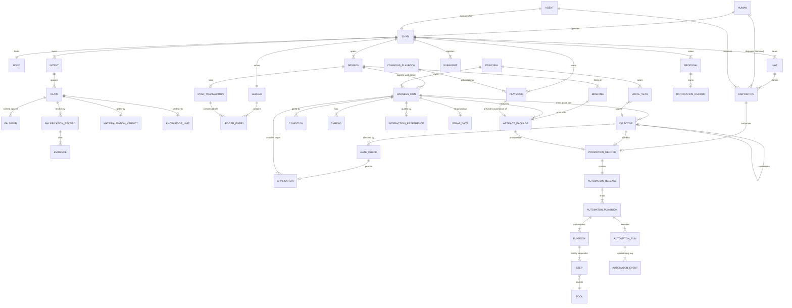

# Dyad System Architecture

Consolidated architecture uniting the **Automaton**, **Harness**, and
**Chief-of-Staff** designs with the three Dyad sources. One entity graph,
four planes, mechanically verified.

## 0. Sources

| Tag | Source | Status 2026-09-18 |
|---|---|---|
| `[pract]` | the-dyad-practice README (public) | observed |
| `[bond-r]` | dyad-bond README (public) | observed |
| `[bond-d]` | dyad-bond DYAD.md (public, 212 lines) | read via raw fetch |
| `[leo]` | dyad-leo DYAD.md (private, 903 lines) | read via authenticated browser |
| `[auto]` | Automaton design package | built + verified |
| `[harn]` | Harness v1.1.0 + Round-2 additions | built + verified |
| `[cos]` | Chief-of-Staff + Round-2 additions | built + verified |

Unretrieved (noted, not modeled): dyad-bond `GLOSSARY.md`,
`dialectic/relationship-craft.md`, `dialectic/carry-forward.md` full text;
the-dyad-practice files beyond the README. dyad-bond's `ID.md` was
**retired 2026-06-28** — identity is a computed view, not a persisted file
`[bond-d]`. P1/P2/P3 (parity/necessity/constitution) and IFF1/IFF2/IFF3 are
`[bond-r]`-sourced; only IFF1 is additionally tagged in `[bond-d]`.

## 1. Conceptual architecture — four planes

```
┌─────────────────────────────────────────────────────────────┐
│ DYAD PLANE — the human+agent team, its bond, memory, law    │
│ Human · Agent · Dyad · Bond · Intent · Claim · Falsifier ·   │
│ FalsificationRecord · Evidence · KnowledgeUnit · Playbook ·  │
│ Hat · Disposition · Session · DyadTransaction · Ledger ·     │
│ Subagent · Briefing · Proposal · Ratification                │
│ Law: falsification. Currency: dispositions. Memory: ledger. │
└──────────────────────────┬──────────────────────────────────┘
                           │ claims that survive materialize into
                           │ definition-of-done conditions
┌──────────────────────────▼──────────────────────────────────┐
│ HARNESS PLANE — guided turns toward machine-evaluable done   │
│ HarnessRun · Condition · Thread · InteractionPreference ·    │
│ ArtifactPackage · StrapGate · AuthorityPolicy · LocalVeto     │
│ Law: conditions. Currency: artifacts. Posture: human-set.   │
└──────────────────────────┬──────────────────────────────────┘
                           │ a CoS run manages other runs' lifecycles
┌──────────────────────────▼──────────────────────────────────┐
│ CHIEF-OF-STAFF PLANE — fleet lifecycle management            │
│ Directive · GateCheck · Application · PromotionRecord ·       │
│ AutomatonRelease                                             │
│ Law: no bypass — every application is gate-checked at the    │
│ target. Currency: directives. Mutation: one applier only.    │
└──────────────────────────▼──────────────────────────────────┘
┌─────────────────────────────────────────────────────────────┐
│ AUTOMATON PLANE — deterministic execution                    │
│ RunBook · Step · Tool · AutomatonRun · AutomatonEvent       │
│ AutomatonFlow · FlowState · FlowTransition · FlowRun        │
│ FlowTransitionEvent (append-only flow log)                  │
│ Law: zero inference. Currency: events. Replay: no re-invoke.│
└─────────────────────────────────────────────────────────────┘
```

**Plane boundaries.** Inference lives only in the Harness plane (wording of
turns), never in Automaton execution, never in the CoS applier, never in
promotion. Human judgment crosses planes only as **Disposition** (terminal,
human-signed) and as immutable step-changes (new versions, injected events,
config updates). The Dyad plane owns *why*; the Harness plane owns *what
counts as done*; the CoS plane owns *when runs change state*; the Automaton
plane owns *what happened*.

**The spine.** One provenance chain runs through all four planes:

Dyad → Intent → Claim → FalsificationRecord → MaterializationVerdict →
Condition → HarnessRun → ArtifactPackage → Directive → GateCheck →
Application → PromotionRecord → AutomatonRelease → RunBook.

## 2. Data schema — entities

### 2.1 Dyad plane

- **Human** `[leo]` — the Operator. Holds intent and stakes. Terminal
  disposition authority: *the agent detects; the human disposes* `[bond-r]`.
- **Agent** `[leo][bond-d]` — diligence and execution. Identity claims
  sanctioned only via the single identity source (`[leo]` §7); birth-id
  frozen at birth, recomputed never trust-stored `[bond-d]`.
- **Dyad** `[pract][bond-r][leo]` — the irreducible team, 1+1=3. Two roles,
  one dyad; neither replaceable `[leo]` N1.
- **Bond** `[bond-r][bond-d]` — state ∈ {covalent, ionic, meld}. Covalence is
  *produced* by running the falsification law on the bond itself and lost
  when it isn't run. Ionic = law bypassed (override, rubber-stamp). Meld =
  law disabled (two models merged, second perspective lost).
- **CovenantGate** `[bond-r]` — IFF1 epistemics, IFF2 no-oracle, IFF3 wu-wei.
- **Intent** `[leo]` — the Operator's overall intent (personal/professional).
- **Claim** `[pract][bond-d]` — falsifiable proposition; states
  draft → under_falsification → survived | refuted. Single canonical home.
- **Falsifier** `[bond-d]` — the *named* falsifier; two-models: an independent
  second model, else meld-counterfeit (IFF1).
- **FalsificationRecord** `[bond-r][pract]` — one attempt; IFF2 requires an
  external separator (independent audit or durability over time).
- **Evidence** `[pract]` — contributor / timestamp / testimonial / audit.
- **KnowledgeUnit** `[pract][bond-d]` — claim + refutation + ledger pointer +
  evidence. Lives in `dialectic/` while under falsification; graduates to
  `kb/` only after surviving. One canonical home per fact (single-home).
- **MaterializationVerdict** `[bond-r]` — a claim enters the shared model iff
  it clears the covenant gates.
- **Disclosure** `[leo]` — upward disclosure of a conflict, error, or
  uncertainty; open | acknowledged | escalated | dismissed. Silence is not
  triage: every non-open disclosure is cited by exactly one triage
  disposition, and none is cited by more than one. `seq` is a
  write-path-minted monotonic counter (DR-5/A1; declared trust, no clock).
  The open-disclosure queue is auditable through the **verification view**
  (DR-5/A2, `package/views.py`): a pure function over SystemState, kind-
  then-seq ordered — independent of any agent's presentation, not of
  authorship. Disposal runs through the **CoS drain duty** (DR-5/B):
  disclosures drain serially via triage CTAs; I-13 bars any governance
  run from closing with undisposed backlog (`seq < run.open_seq`) and
  flags an orphaned queue (open disclosures, no non-closed governance
  run). Progress *within* an open run is not mechanically enforced —
  declared cost of the verification-only surface.
- **Playbook** `[leo]` §21 — every recurring domain gets a playbook *before*
  automation. Exactly three plays: start a thing, stop a thing, keep a thing.
  Plays are **not a sequence** — each play is a definition-of-done
  conditional (entry trigger + exit condition), condition-triggered and
  re-entrant, carrying no sequence state. Sequentiality lives in run-books,
  not play-books.
  Origin: Commons or dyad specialization `[pract]`.
- **CommonsPlaybook** `[pract]` — shared playbooks, e.g. Proposal-Framing
  (propose one path; strongest counter; reconciliation; ask one Y/N).
- **Hat** `[bond-d]` — Bond Operator (proposer+ratifier), Founding Operator
  (form gate), Steward Operator (intake/coordination). A disposition reaches
  only the hat that owns it.
- **Disposition** `[bond-r][bond-d][leo]` N6 — proposer = agent, disposer =
  human, never the same (no-self-ratify). DFD: genuine non-strawman
  anti-thesis → synthesis, at most one `[CTA·Y/N]` per turn. Irreversible
  actions need explicit Operator authorization. **Mode** selects the
  definition of done: ratify | authorize | set_standing | overrule | triage
  (§8.2); a disposition reaches only the hat that owns it. CTA responses
  are yes | no | counter (E3); authorize binds action + artifact hash
  (E2); overrule may absorb the veto's reason into a directive amendment
  (E7).
- **DecisionRecord** `[playbook]` (E1/E4) — the record of a playbook run:
  matter, options + gate trails, premises as explicit record-ID citations,
  verdict, dialectic trail with designated separator, rehearsal flag.
  Rehearsal records are quarantined: no non-rehearsal record may cite
  them as premises (I-11).
- **Session** `[leo]` — kinds substrate / workstream / engagement; verbs
  plan/start/stop/pause/resume; one owner; explicit boundary; a falsifiable
  claim (what would prove the session failed); snapshot isolation.
- **DyadTransaction** `[leo]` — the dyad loop as a DB transaction:
  begin / do / commit-or-abort. Commit = state + ledger entry, atomically.
  Abort = return to last committed state *and record the attempt*.
- **Ledger / LedgerEntry** `[leo]` §26 — the dyad's memory and audit trail;
  the write-ahead log. Timestamped. Memory not written down is not trusted.
- **Subagent** `[leo]` — registered roster: M265 Facilitator (session
  hygiene, active), FIA (read-only analyst: advises, never acts), Travel
  Specialist (read-only planner; Operator approves).
- **Briefing** `[leo]` §24 — the unit of communication; must end with a
  checkable artifact, else it was a conversation, not work.
- **Proposal / RatificationRecord** `[leo]` §25 — proposals earn ratification
  through checkable criteria; failures return to draft *with the failure
  attached*.

### 2.2 Harness plane `[harn]`

- **Principal** — body a run belongs to. **HarnessRun** — open | paused |
  closed (completed | abandoned | aborted); flat threads; at most one
  non-closed run per (principal, authority-scope), where authority-scope is
  execution | governance. A CoS run is a HarnessRun with
  authority_scope=governance whose exclusive outputs are lifecycle
  directives — it coexists with the execution run it manages because the
  scopes are disjoint by construction.
- **Condition** — definition-of-done in the shared expression language;
  required conditions gate completed closure. **Thread** — derived
  awaiting_llm | settled | suspended. **InteractionPreference** —
  human-controllable posture (challenge_claims, clarify_intent,
  invoked_preference).
- **ArtifactPackage** — machine-native output: schema + instances + surface;
  carries a domain, which must be covered by a dyad Playbook (playbook before
  automation). **StrapGate** — strap/unstrap over required conditions.
- **AuthorityPolicy** — on_conflict ∈ {fleet_wins (default), local_wins}.
- **LocalVeto** — principal-owned, targets a proposed directive; status
  upheld | overruled; logged either way — dissent is data.

### 2.3 Chief-of-Staff plane `[cos]`

- **Directive** — lifecycle directive referencing target runs by identity
  (never nested). Reversible countermands carry supersedes_directive_id.
  Closed-run freeze dominates: terminal transitions are not supersedable.
- **GateCheck** — recorded per application, per-gate results; initiation is
  fleet-level, validation is target-level; no bypass privilege.
- **Application** — the deterministic zero-inference applier, the only
  mutation channel. Failure rejects the directive; never silently converts
  (e.g. to abandoned).
- **PromotionRecord** — mechanical zero-inference promote: validated source
  artifact, unique release version, applied source directive when cited,
  Operator disposition for the irreversible publish.
- **AutomatonRelease** — immutable.

### 2.4 Automaton plane `[auto]`

- **RunBook** — the automaton plane's executable unit: strictly sequential
  steps (**Step** — AST-allowlisted expression, compiled once — invoking a
  **Tool**); pinned to a shipped release by `release_version`. **AutomatonRun**
  runs a single run-book: single-threaded actor, single-writer lease,
  immutable cfg, mutable ctx, deterministic idempotency keys, timer events,
  retries, skip, compensation, abort. **AutomatonEvent** — append-only log,
  the source of truth; replay never reinvokes tools.
- **AutomatonFlow** `[auto]` (2026-09-19) — the FSM orchestrating run-books:
  new machinery, not a restoration of AutomatonPlayBook (an unmodeled label
  collapsed into RunBook). **FlowState** (`task` binds a run-book and declares
  an explicit `step_policy` — `abort | skip | retry:<n>`; `wait` holds for
  `timer`/`external`; `end` declares `completed | aborted`).
  **FlowTransition** — trigger `timer | run_completed | run_aborted |
  external`, AST-allowlisted guard; transitions sharing (from, trigger) are a
  *set*, never a ranking — no priority discrimination (I-15).
  **FlowRun** — the scheduler; per-state work runs as child AutomatonRuns
  (`parent_flow_run_id` / `flow_state_id`). **FlowTransitionEvent** —
  append-only transition log; replay re-derives states from it. Invariants:
  I-14 flow totality (every non-end state routes every fate — the mechanical
  form of "exceptions are managed"), I-15 transition determinism, I-16
  flow-run closure bar (a done/aborted run sits in an end state).
- **automaton-executor** (DR-CMD-054, built: `lib/dsys/executor.py`) — the
  plane's deterministic walker (AX2): steps run-books (AST-allowlisted
  guards; `abort | skip | retry:<n>`; parked quiescence; crash-recovery
  re-invocation), drives flows (child runs, `run_completed`/`run_aborted`
  triggers, fixed-template `automaton-exception` disclosures on unhandled
  triggers), and re-validates transcripts without reinvoking tools
  (I-28/I-29/I-30). Spec: `doc/automaton-executor-spec.md`.

## 3. Process schema — lifecycles

| Process | States / verbs | Terminal rule |
|---|---|---|
| Dyad loop | begin → do → commit \| abort | commit publishes state + ledger atomically; abort records the attempt |
| Session | plan → start → pause ⇄ resume → stop | one owner; boundary; falsifiable claim |
| Claim | draft → under_falsification → survived \| refuted | survived requires external separator (IFF2) |
| Knowledge | dialectic → kb | graduation requires a survived claim |
| Playbook | (three plays: start/stop/keep a thing) | must exist before its domain is automated |
| Proposal | proposed → ratified \| returned_to_draft | failure attached on return |
| Harness run | open ⇄ paused → closed(completed\|abandoned\|aborted) | completed requires all required conditions |
| Directive | proposed → gate-checked → applied \| rejected | rejected is never converted; vetoes logged |
| Promotion | validated → promoted → released | unique version; Operator disposition |
| Automaton run | running → completed \| compensated \| aborted | events append-only; replay is pure |

Cross-plane processes: **falsification loop** (claim → counter →
reconciliation → Y/N, from Proposal-Framing `[pract]`); **directive pipeline**
(decision → directive → gate check → application → target event);
**promotion pipeline** (artifact → promotion → release → play-books).

## 4. Invariants

- **I-1** Materialization requires a survived claim, a surviving record with
  an external separator (IFF1/IFF2), and all covenant gates green.
- **I-2** No self-ratify: disposer ≠ proposer; the disposer is the dyad's
  human; at most one CTA per disposition (DFD). Mode-specific definitions
  of done: authorize names its action (nameless authorization refused);
  set_standing names its domain and forms one supersession chain per domain
  (parallel roots refused); overrule cites an existing veto (which stays
  logged), and an overruled veto must cite its backing overrule
  disposition; triage cites its disclosure, and every non-open disclosure
  has exactly one triage disposition.
- **I-3** Single-home: one canonical home per fact; kb graduation requires a
  survived claim.
- **I-4** Every playbook holds exactly the three plays (start/stop/keep),
  each defined as a conditional (entry trigger + definition of done), never
  as ordered steps. Plays are re-entrant: stop may fire on what start never
  opened, and keep's standing rule runs until falsification re-triggers stop.
- **I-5** Briefings end with a checkable artifact; returned proposals carry
  their failure.
- **I-6** Committed/aborted transactions always land a ledger entry; sessions
  carry owner, boundary, falsifiable claim.
- **I-7** No bypass: application requires a passed gate check for that
  directive; close_completed requires all required target conditions.
- **I-8** Release versions unique; promotions need preconditions, an applied
  cited directive, an approved AUTHORIZE-mode Operator disposition for the
  irreversible publish, and a dyad playbook for
  the artifact's domain. The authorization binds the artifact's hash at
  disposition time; stale or unbound authorization refuses (E2, N6).
- **I-11** Citation integrity (E1): a non-rehearsal decision record's
  premises must resolve to real, decided, non-quarantined records.
- **I-12** Dialectic separator (E4): dialectic mode requires a designated
  separator; self-separation is rehearsal by construction.
- **I-9** At most one non-closed run per (principal, authority-scope):
  a governance (Chief-of-Staff) run coexists with the execution run it
  manages — scopes disjoint by construction, no silent exception;
  vetoes always resolved to upheld | overruled; authority policy explicit.
- **I-10** Unique step seq per run-book; unique event seq per automaton run.

## 5. Unified ERD



## 6. Golden provenance walkthrough

The verified golden run walks the spine end to end: dyad *leo*
(Operator + Leo, birth-id `sha:1ab6ad0`, bond covalent) → intent *ship the
monthly close run-book* → claim *the close run-book is deterministic under
replay* → independent-model falsifier → surviving record with external
separator (*independent audit of 3 monthly closes*) → IFF1/2/3 green →
materialized → knowledge unit graduated to kb → playbook *monthly-close*
(start/stop/keep) → workstream session (owner, boundary, falsifiable claim)
→ transaction committed (atomic ledger entry) → harness run with two
satisfied required conditions → artifact package (domain monthly-close) →
CoS directive *promote* → gate check passed → application → promotion
(authorized by approved Operator disposition) → release 1.0.0 →
automaton play-book / run-book / step / tool → automaton run + event log.

## 7. Verification

Machine-native package (`dyad-architecture.zip`): `schema.py` (45 entity
classes; 44 populated in the golden chain), `validators.py` (invariants
I-1..I-12 + refusal operations),
`golden_run.py`. Run from the directory containing `package/`:
`python3 -m package`.

Result 2026-09-18: **PASS** — 49 entities, 0 golden-chain violations.
Refusal cases: incomplete `close_completed` refused naming the unsatisfied
condition; duplicate release version refused; materialization without a
surviving externally-separated record refused (IFF1/IFF2); upheld
local_wins veto rejects the directive (veto stays logged); self-disposition
flagged (no-self-ratify); second open execution run under one principal
refused under refined I-9 (governance run coexists); authorize-mode
disposition without a named action refused under I-2; irreversible publish
on a ratify-mode disposition refused (AUTHORIZE-mode required, N6);
non-open disclosure without its triage disposition flagged; parallel
standing policies on one domain flagged (one supersession chain); overruled
veto without a backing overrule disposition flagged; premise citing a
quarantined rehearsal record flagged (I-11); premise citing an undecided
record flagged (I-11); dialectic run without a designated separator
flagged (I-12); self-separation unlabeled as rehearsal flagged (I-12);
stale authorization refused — artifact changed since disposition (E2, N6);
approved authorize disposition without state binding flagged (I-2);
counter-proposal without counter text flagged (I-2); counter-proposed
disposition left approved flagged (I-2); absorption citing a missing
directive flagged (RI); absorption on a non-overrule disposition flagged
(I-2); triage record selecting "decide nothing" flagged — silence is not
an outcome (I-2, E5); publish with no disposition at all refused
(authorize silence = no action, N6).

## 8. Source incorporation policy

Decision criteria used to admit elements from the reference repos
(the-dyad-practice, dyad-bond, dyad-leo) into this architecture. Every
admission is falsifiable: show the concept has no instances, no transitions,
and no writable validator, and it gets cut.

**Entity admission (all required):**

- **C1 — Entity-shaped.** Names a thing with instances, identity, and usually
  lifecycle states. Test: can I create two of these, tell them apart, and does
  it change state?
- **C2 — Authoritative source.** Stated in a constitutional or definitional
  file (DYAD.md, README core claims, glossary) — not in passing prose,
  reflections, or issues.
- **C3 — Non-duplicative (single-home).** No existing entity already covers
  it; if covered, map to the canonical name instead of adding a synonym.
- **C4 — Mechanism, not narrative.** It does work: constrains a transition,
  gates an operation, or carries provenance. Testimonials and war stories are
  excluded.

**Invariant promotion (entity → checkable rule):**

- **C5 — Validator-writable.** The rule can be expressed as a mechanical check
  over the entity graph. If it cannot be checked, it is documented guidance,
  not an invariant.

**Provisional rule:**

- **C6 — Tag the uncertain.** Anything from unretrieved files, or inferred
  beyond what the source states, is tagged provisional and never silently
  promoted.

**Fast exclusions:** X1 instance data, not type (a specific roster's members
are rows, not entities); X2 single-repo implementation detail (file paths,
scripts) that generalizes to no cross-plane mechanism; X3 purely aspirational
statements with no operational content.

**Procedure:** candidate → locate source + authority → C1–C4 → dedupe (C3) →
entity or reject → C5 → invariant or documented → tag source/provisional →
log the decision.

**Decision log (sample):**

- Bond states covalent/ionic/meld `[bond-d]` — include, documented. C1–C4
  pass; no validator yet, so not an invariant.
- Disposition, proposer≠disposer `[bond-r][bond-d][leo N6]` — include +
  invariant I-2.
- Playbook triad `[leo §21]` — include + invariant I-4.
- DyadTransaction commit/abort `[leo]` — include + invariant I-6.
- FalsificationRecord + external separator `[bond-r IFF2]` — include +
  invariant I-1.
- Subagent roster members (M265/FIA/Travel) `[leo]` — type included;
  the three names are instance data (X1), not entities.
- 13 dated reflections `[leo reflect/]` — excluded: fails C1, C4.
- Token scarcity `[leo §32]` — deferred: fails C5 today; becomes a Budget
  entity if cost is ever modeled.
- Invariant-DAG anchor form `[bond-d]` — excluded for now: representation
  choice of one repo, no cross-plane mechanism (X2); candidate for a future
  verification plane.
- Birth-id immutability `[bond-d]` — included as an immutable field
  constraint; not yet a standalone validator.

## 8.1 Decision funnel (additive, by furthest gate reached)

40 repo-sourced candidates. VetoPolicy, Directive, AutomatonRelease are
absent — they came from our stress-test specs and designs, not the repos.

**Tier 1 — C1→C5, invariant (8):** Claim lifecycle (I-3); FalsificationRecord
(I-1); ExternalSeparator (I-1/I-5); MaterializationVerdict (I-1);
Disposition, proposer≠disposer (I-2); Playbook triad (I-4); DyadTransaction
(I-6); irreversible actions require approved Operator disposition `[leo N6]`.

**Tier 2 — C1→C4, admitted entity, documented only (16):** Dyad; Bond +
states covalent/ionic/meld; Identity as computed view, birth-id immutable;
Intent; Falsifier; Evidence; Ledger; CanonicalHome; Human vs Agent distinct
types + principal hierarchy; Session; Subagent (type); Ratification;
Briefing; ProposalFrame / DFD turn discipline (Y/N-CTA rule is a candidate
invariant, validator not yet written); upward disclosure events; Commons
`[pract]` (C6 provisional, README-only source).

**Tier 3 — C1→C2, merged as duplicates, C3 (4):** KnowledgeUnit → Claim +
Evidence + Ledger; dialectic/ vs kb/ → Claim.state; Hats → Human.role enum;
"agent work draft until Operator commits" → DyadTransaction + Disposition.

**Tier 4 — C1 only, failed C2 (0):** none — everything entity-shaped found so
far sits in constitutional or definitional files.

**Tier 5 — failed C1 (2):** Surplus (attribute of Dyad); "no private-repo
material on public surfaces" (policy on the assistant, out of system scope).

**X — fast exclusions (4):** 13 dated reflections (narrative); bin scripts,
CLAUDE.md shim, invariants-leo.yaml (X2); M265 / FIA / Travel Specialist
(X1 instance rows); invariant-DAG anchor form (X2; candidate for a future
verification plane).

**Deferred — C6 provisional or C5-blocked (6):** P1/P2/P3 (needs
GLOSSARY.md); token scarcity §32 (needs a Budget entity); single-home rule
(candidate invariant); no unsupported certainty (candidate invariant); no
silent self-modification (candidate invariant); verifiability bar for
artifacts (candidate invariant, harness bridge).

## 8.2 Decision-making playbook (general)

Canonical text: `doc/decision-making-playbook-spec.md` (consolidated
2026-09-21; previously the E-spec-only file `playbook-enhancements-spec.md`).
Summary: plays are definition-of-done conditionals (entry trigger + exit
condition), condition-triggered and re-entrant, never ordered steps (I-4).
Parameters per decision: matter, gate list (G1–G6), exclusion rules,
disposer, disposition mode (ratify | authorize | set_standing | overrule |
triage, each with its own DoD). START / STOP / KEEP. DecisionRecords (§8.3)
writable only on disposition. Enhancements E1–E5, E7 (DR-4); E6 killed.
Implemented: `core/package/{schema,validators,golden_run}.py`; golden run
37 refusal cases, PASS.

Playbook inventory (DR-CMD-021, ratified 2026-09-21): the ratified playbooks
are `doc/decision-making-playbook-spec.md` (Architecture §8.2) and
`doc/dsys-mutation-playbook-spec.md` (Architecture §8.4). Draft and
exploratory playbook specs (`doc/feature-expansion-playbook-spec.md`,
`doc/dsys-transcription-playbook-spec.md`,
`doc/dialectic-enhancements-spec.md`) live in `doc/`; their standing is
declared in the files themselves, not here.

## 8.3 Decision records

Canonical records: `doc/decision-making-playbook-spec.md` §6 (DR-1..DR-4,
ratified 2026-09-18). Summary: DR-1 CoS-run coexistence invariant; DR-2
disposition modes as playbook parameter; DR-3 mechanical closures; DR-4
simulation-derived enhancements E1–E5, E7 (E6 killed).

## 8.4 Mutation playbook (second playbook)

Ratified 2026-09-19 (decision-making playbook): post-installation, the
user has maximum flexibility to mutate even dsys's own files, via
fork/clone of the dsys-repo. The decision criteria are implemented as
the second playbook, following the pattern of §8.2: a set of
definition-of-done conditionals (never a sequence), START/STOP/KEEP,
own gates (G1–G4 + M1–M4: ladder / trust-boundary declaration / upgrade
fate / audience), the shared DecisionRecord entity discriminated by
`playbook`, and the single disposition machinery (ratify / overrule /
triage for mutation matters). The rung ladder, least → most invasive:
`configure` | `role` | `scenario` | `wrap` | `patch` | `fork`.

Mechanical closures: **I-17** — adopted mutation records name a valid
rung; trust-boundary mutations declare `voided_guarantees`; adopted
records state a reason classified `accepted` (evidenced by observations
in artifacts/afferent) or `pending` (human disposition, unevidenced) —
no reason, no mutation (completeness checked, truth declared — declared
trust). The declared-mutation rule (installer surface): `doctor`
distinguishes pristine from mutated and reports what diverged; the
manifest records fork identity. Full spec: `doc/dsys-mutation-playbook-spec.md`.
Golden run: 37 refusal cases (33 + I-17 ×4), PASS, 0 violations.
