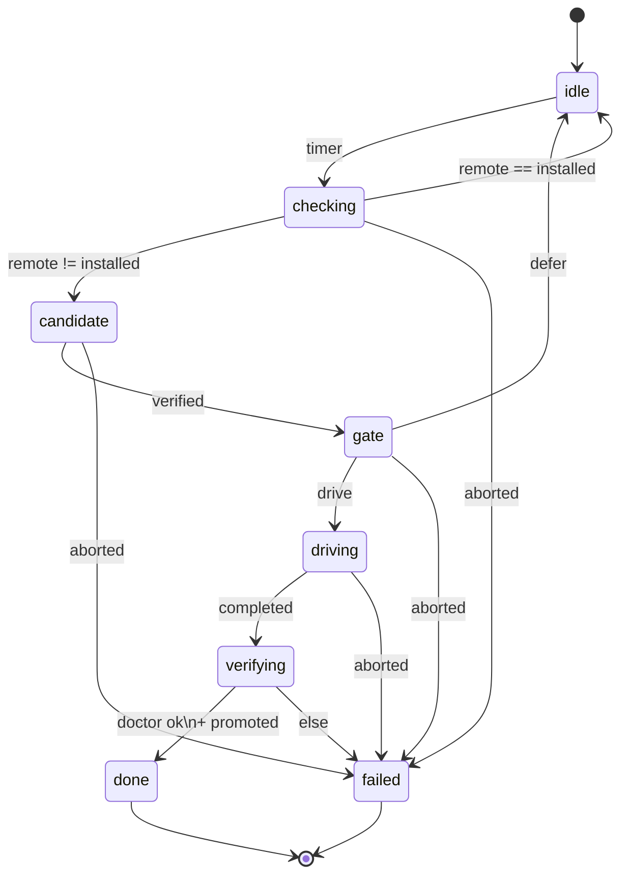

# Updater spec — the release-monitor automaton

- **Status:** adopted as the matter's spec per DR-CMD-035 (2026-09-21) — the build's basis; changes during build must keep the evaluated conditionals holding
- **Date:** 2026-09-21
- **Matter:** the narrowed updater claim (DR-CMD-032) — "dsys should gain a release-monitor automaton such that it watches dsys releases and, on a new release, drives an upgrade by invoking `install.sh --release` (existing), recording the step-change via the promotion bridge, honoring accretion-repo tree discipline, and executing as a FlowRun via the DR-CMD-030 bridge — the monitor/trigger logic being the new delta, the perform step composed, not duplicated."
- **Purpose:** the A4 artifact for the narrowed updater expansion matter — the spec that the next governed `/pb-extend` evaluation needs before its conditionals can be evaluated.

## Glossary

- **Release-monitor:** the automaton specified here. Watches the dsys release feed; on a newer release, drives an upgrade. The new delta (the perform step is composed from existing machinery).
- **Feed:** the release feed (pinned URL in config). The sole network touch.
- **Poll:** one GET of the feed, performed by the `release-check` run-book.
- **Candidate:** a release newer than the installed one whose checksum verifies — admitted to the trust gate.
- **Trust gate:** the `gate` state — evaluates the operator's standing upgrade policy; the only path to `driving`.
- **Driving:** invoking `install.sh --release <version>` (existing installer machinery — composed, not duplicated).
- **Standing policy:** the operator's pre-recorded upgrade authorization (`updater.policy`, `updater.auto_max_bump`) — the disposition, made in advance.
- **Replay:** re-deriving the state path from the recorded `FlowTransitionEvent` log — never re-invoking tasks, never re-touching the network (the entity's own definition).
- **Hermeticity:** per-command — each command's external touches are declared and confined; replay touches nothing external.

## 1. The flow

`AutomatonFlow` name `release-monitor`, `initial_state_id` `idle`. Eight states, ten transitions. The transition table is total over the flow's trigger alphabet (`timer`, `run_completed`, `run_aborted`); `external` is unused by this flow (documented exclusion, not an oversight — see K3 in §9 for the specified consequence: there is no "check now" path). Every path terminates in `done` or `failed` (I-16 flow-run closure holds by inspection of the table).

| # | from | kind | run-book | trigger | guard | to |
|---|------|------|----------|---------|-------|----|
| 1 | `idle` | wait | — | timer(`updater.poll_interval`) | — | `checking` |
| 2 | `checking` | task | `release-check` | run_completed | `payload.remote_version != payload.installed_version` | `candidate` |
| 3 | `checking` | task | `release-check` | run_completed | `payload.remote_version == payload.installed_version` | `idle` |
| 4 | `checking` | task | `release-check` | run_aborted | — | `failed` |
| 5 | `candidate` | task | `release-verify` | run_completed | — | `gate` |
| 6 | `candidate` | task | `release-verify` | run_aborted | — | `failed` |
| 7 | `gate` | task | `policy-gate` | run_completed | `payload.decision == 'drive'` | `driving` |
| 8 | `gate` | task | `policy-gate` | run_completed | `payload.decision == 'defer'` | `idle` |
| 9 | `gate` | task | `policy-gate` | run_aborted | — | `failed` |
| 10 | `driving` | task | `release-drive` | run_completed | — | `verifying` |
| 11 | `driving` | task | `release-drive` | run_aborted | — | `failed` |
| 12 | `verifying` | task | `release-verify-installed` | run_completed | `payload.doctor_ok and payload.promotion_recorded` | `done` |
| 13 | `verifying` | task | `release-verify-installed` | run_completed | `not (payload.doctor_ok and payload.promotion_recorded)` | `failed` |
| 14 | `verifying` | task | `release-verify-installed` | run_aborted | — | `failed` |

`done`: kind=end, outcome=completed. `failed`: kind=end, outcome=aborted.

The monitor is non-terminating under `notify`/`off` (and on bump-scope deferral): the steady state is the watch cycle `idle→checking→candidate→gate→idle` itself. `done`/`failed` are reached only via driving/verifying or faults.

(Transition #9 — `gate` on `run_aborted` — is required by I-14: every task state must route `run_aborted` somewhere. Found by the standing `_flow_totality` validator during the build; the table is total.)

I-15 (transition determinism): transitions sharing (`checking`, `run_completed`) carry disjoint guards (`!=` vs `==` — exactly one true wins); sharing (`gate`, `run_completed`) likewise (`'drive'` vs `'defer'` — the run-book emits exactly one). Ambiguity would be a fault, not an ordering problem — there is none by construction.

Step policies: `checking` retry:3 then abort (transient network); `driving` abort (a failed upgrade is never blindly retried — the failure is surfaced); others abort. Explicit — no silent defaults.

Guards are AST-allowlisted expressions over `payload.*` (the v1 Python-syntax subset — comparisons, `and`/`not`, attribute access; compiled once).

### Run-books (referenced by id; authored at build)

- `release-check`: GET the feed; emit payload `{feed_sha256, remote_version, installed_version, checksum}`. Mechanical — version comparison only, no inference.
- `release-verify`: verify the candidate's checksum against the feed's declared checksums. Checksum mismatch → run_aborted (no candidacy, `failed`).
- `policy-gate`: read `updater.policy` / `updater.auto_max_bump`; emit `{decision: 'drive' | 'defer', reason}`. Pure function of config — no inference.
- `release-drive`: invoke `install.sh --release <version>`; emit `{exit_code}`. The composed perform step.
- `release-verify-installed`: run doctor; confirm the accretion commit and the promotion record; emit `{doctor_ok, promotion_recorded}`.

## 2. Source models (pydantic v2 — the DR-CMD-028 pin)

Pinned: **pydantic v2** (2.13.5 installed; `core/package/schema.py` already v2-style). The models below are the DR-CMD-028 source definitions; the DR-CMD-030 bridge compiles them into `FlowState`/`FlowTransition` entities executed by `FlowRun`. Module placement is the bridge matter's decision — the spec owns the semantics.

```python
from pydantic import BaseModel, ConfigDict, Field
from typing import Literal

Trigger = Literal['timer', 'run_completed', 'run_aborted', 'external']
StateKind = Literal['task', 'wait', 'end']
EndOutcome = Literal['completed', 'aborted']

class MonitorState(BaseModel):
    """One FSM state — compiles to FlowState."""
    model_config = ConfigDict(frozen=True)

    name: str
    kind: StateKind
    runbook_id: str | None = None          # required iff kind == 'task'
    step_policy: str | None = None         # iff kind == 'task': abort | skip | retry:<n>
    outcome: EndOutcome | None = None      # iff kind == 'end'

class MonitorTransition(BaseModel):
    """One guarded edge — compiles to FlowTransition."""
    model_config = ConfigDict(frozen=True)

    from_state: str
    trigger: Trigger
    guard: str | None = None               # AST-allowlisted expr over payload.*
    to_state: str

class ReleaseMonitorFlow(BaseModel):
    """The release-monitor automaton — compiles to AutomatonFlow + states + transitions."""
    model_config = ConfigDict(frozen=True)

    name: Literal['release-monitor'] = 'release-monitor'
    release_version: str
    initial_state: str = 'idle'
    states: list[MonitorState] = Field(min_length=1)
    transitions: list[MonitorTransition] = Field(min_length=1)
```

The §1 table is the authoritative instance of `ReleaseMonitorFlow` (states §1 rows, transitions §1 #1–13).

## 3. Replay story (R1)

Replay re-derives states from the `FlowTransitionEvent` log; never reinvokes (the entity's definition). Concretely:

1. Every external input is captured as an event payload at the moment it occurs: the poll result (including `feed_sha256`), the installer's exit code, the doctor output.
2. Replay starts a fresh `FlowRun` at `initial_state` with the network disabled, feeds the recorded payloads in `seq` order, and re-evaluates the guards.
3. Deterministic: the same log yields the same state path (I-15) — the checkable assertion is hash equality of the derived state sequence between the live run and the replay.

The network is *sampled*, never executed-deterministically: `wait` states holding for `timer`/`external` are the architecture's existing model for external observation, and the event log is the replay source of truth (same move as dialog's context scope: replay is audit-reconstruction, not re-execution).

## 4. Trust declaration (R5)

- `updater.policy`: `auto | notify | off` (default `notify`). Operator-owned config.
- `updater.auto_max_bump`: `patch | minor | major` (default `patch`) — bounds what standing authorization covers.
- `updater.poll_interval`: seconds between polls (default 3600). `updater.feed_url`: pinned feed URL.
- `auto`: the operator's standing authorization *is* the disposition, made in advance (the architecture already works this way — accretion's standing authority). The `gate` state drives only when policy and bump-scope both admit the candidate.
- `notify`: the candidate is recorded and surfaced; the flow returns to `idle` — nothing is driven.
- `off`: candidates are recorded; nothing is driven, nothing is surfaced beyond the log.
- The automaton cannot alter its own policy: policy is read-only input to `policy-gate`; no transition writes it. Policy changes are operator step-changes.
- Every driven upgrade is recorded twice: the promotion bridge (`AutomatonRelease`/`PromotionRecord` — the step-change) and the accretion-repo commit (the tree discipline). Both are preconditions of `done` (transition #11's guard). — K1 (§9) qualifies this: the installer's commit covers install-time state only; the updater's own inter-install state (the event log — the R1 source of truth) has no writer under the current assignment.

## 5. Hermeticity story (P2)

- The sole network touch is the `release-check` poll — a GET of the pinned feed URL. Confined to that run-book; the result enters the machine only as an external trigger payload (data, content-hashed into the event log — the dialog R5 boundary: no instruction field, never resolved by the untrusted side).
- Version comparison and checksum verification are mechanical (no inference anywhere in the loop — R4 holds).
- `install.sh --release` runs under the existing per-command hermeticity.
- The poll sends nothing out: no instance state leaves the machine (stated, checkable by inspection of `release-check`).
- Replay touches nothing external (§3).

## 6. Falsification (A1)

Two genuine attempts, both survived:

- **F1 — determinism vs. network:** "FlowRun determinism (I-15) is incompatible with network watching; nondeterministic payloads break transition determinism." *Survived:* determinism is evaluated over the recorded event log, not the live network — the architecture already models external observation (`wait` for `timer`/`external`) and defines replay as re-derivation from the log. The network is sampled; the machine is deterministic over the sample.
- **F2 — the authority line:** "An automaton driving upgrades disposes without the operator — ambient proposes, operator disposes, violated." *Survived with condition:* the standing policy (`auto` + bump scope) is the operator's disposition made in advance; every driven upgrade is promotion-recorded and accretion-committed (fully auditable); the automaton cannot escalate its own policy. The condition is load-bearing and is specified in §4.

## 7. Acceptance (A5 — checkable sequences)

1. Fixture feed with a newer version, `policy=auto` → the run reaches `done`; the event log shows `idle→checking→candidate→gate→driving→verifying→done`; a promotion record and an accretion commit exist.
2. Same fixture, `policy=notify` → one watch cycle `idle→checking→candidate→gate→idle` (the monitor is non-terminating under notify — the cycle is the steady state); `install.sh` is never invoked; the candidate is recorded.
3. Replay acceptance #1's log with the network disabled → the derived state sequence hashes equal.
4. Fixture feed with a checksum mismatch → `failed`; no candidacy recorded.
5. F1/F2 falsification records exist (this section).
6. Installer failure (nonzero exit) → `failed` via `driving` run_aborted; the attempt is recorded, no promotion is recorded, the installed version does not converge.

## 8. Open questions

- The mermaid diagram for §1 awaits the pydantic→mermaid generator (a future governed expansion matter — not hand-drawn here, to avoid preempting it).
- Run-book bodies (`release-check`, `release-verify`, `policy-gate`, `release-drive`, `release-verify-installed`) are build work, after the bridge matter decides module placement.
- `external` trigger is unused by this flow; if a later revision needs operator-injected events (e.g., "upgrade now"), they enter as external payloads through the same event log. K3 (§9) specifies what that revision must add: an `external` edge on `idle` plus a governed initiation path.
- K2 (§9) leaves open the cross-install adoption question: the drive must explicitly resume the previous installation's accretion repo (not rely on ambient installer defaults), and the unwritable-path edge needs a refusal-or-loud-surface rule for autonomous operation.

## 9. Specified kills — operator testing 2026-09-21

Three claims about the built updater, each tagged `falsify` by the operator. All three broke. Specified here per DR-CMD-036 ("kills specified, survivors recorded"). None overturns the DR-CMD-034 evaluated conditionals; K1 exposes an unevaluated durability premise beneath R1 (noted below). Repairs are named as directions, not designs — each is a future disposition.

### K1 — "updater accretion should not be transient and is persisted to accretion repo" — KILLED

- **Claim:** the updater's accreted state (event log, promotion records, policy) is persisted to the accretion repo, not held transiently.
- **Falsifying observation (build):** `core/package/updater.py` persists nothing — the driver's events live in an in-memory `SystemState`; `_tool_invoke_installer` and `_tool_record_promotion` write to in-memory world lists. Both conjuncts (not-transient, persisted-to-repo) fail.
- **Falsifying observation (spec):** §4 assigned accretion persistence to the installer ("the installer's own doing, not the automaton's") — but the installer's pre/post snapshots commit at install time only. The updater's event log, the R1 source of truth, accrues *between* installs with no writer. A crash between installs loses replay. The assignment is wrong for inter-install state.
- **What survives:** the installer's pre/post snapshots do cover install-time state; promotion recording is modeled (as a world fact, not a commit).
- **Repair direction:** the updater needs its own accretion-commit path — write the event log into the instance `var/` (the accreted set) and commit on a defined cadence under standing `commit_authority`, or add a commit step to the drive. Note on R1: the evaluated replay story (§3) assumes a durable log it does not provide — the story stands, the durability premise is unevaluated and currently false.

### K2 — "new installation of updater should by default adopt previous installation's accretion" — KILLED

- **Claim:** a new installation adopts the previous installation's accretion repo by default.
- **Falsifying observation (build):** the build has no install-home and no accretion-repo concept — a fresh `World` starts with empty promotions, empty surfaced candidates, default policy. Previous accretion is not adopted; it does not exist as a concept.
- **Falsifying observation (design edge):** the installer *intends* adoption via default-resume, but the updater never wires to it (the build's installer tool takes no accretion path or resume flag — it relies on ambient defaults). Worse: the unwritable-accretion-path edge (warning + install completes, no accretion) drops history silently — under autonomous `policy=auto` operation with no human watching, "by default" fails in exactly the failure mode.
- **What survives:** installer default-resume adopts on the happy path (`--release` preserves config/state/log per the idempotency exercise).
- **Repair direction:** the drive's installer invocation must explicitly pass/resume the accretion path rather than relying on ambient defaults; the unwritable-path edge needs a rule for autonomous operation — refuse the drive (not warn-and-continue), or surface loudly enough that silence cannot mean history loss. Which rule is a disposition.

### K3 — "updater run supports ambient agent invocation" — KILLED

- **Claim:** the updater run can be invoked by the ambient agent.
- **Falsifying observation (flow):** `idle` admits `timer` only — no `external` trigger edge. I-14 is satisfied by the timer alone, so the standing validator does not catch this; the gap is in the requirement, not the check.
- **Falsifying observation (surface):** no invocation surface exists — no CLI command, no dialog request type, no ambient-callable entry point. The only driver is the test harness.
- **Falsifying observation (rebuttal):** the operator's counter — "invocation from test harness is sufficient; test harness is an actual `Harness` instance" — was itself falsified: `drive()` instantiates no `HarnessRun` (schema.py:481), uses no conditions/turns/strap-gates; it is a bespoke deterministic walker over `AutomatonFlow` entities. And it is called by golden-run test code, not by the ambient agent — no path exists from ambient to driver.
- **What survives:** the §1 exclusion of `external` stands as designed — the updater's autonomy derives from standing policy (timer-driven), not from ambient invocation. Under the authority model the ambient proposes; it does not initiate automaton runs.
- **Repair direction:** *if* a "check now" path is ever wanted, it needs two things together — an `external` trigger edge on `idle` in the flow table, and a governed initiation path (propose→disposition, or standing authorization covering ambient-initiated checks). Whether it should exist at all is a disposition; the current answer is no.

*Illustrative sketch of §1 (hand-drawn, not generated — pending the generator):*


